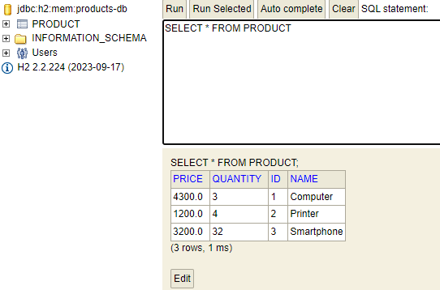

<h3>Activité Pratique N°2   </h3>

1. Créer l'entité JPA Product :

2. Configurer l'unité de persistance dans le ficher application.properties :

3. Créer l'interface JPA Repository basée sur Spring data :

4. Les différentes opérations :

5. Les exécutions avec H2 Database :

6. Les exécutions avec MySQL/Apache :

